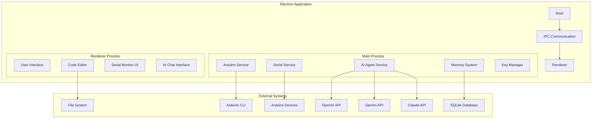

# Design Document: Arduino IDE Cursor

## Overview

Arduino IDE Cursor is an AI-powered desktop application built on Electron that provides an intelligent alternative to the traditional Arduino IDE. The system integrates Arduino CLI for compilation and device management, implements real-time serial communication, and leverages multiple AI providers through a structured tool-based architecture to assist developers with error analysis, code suggestions, and troubleshooting.

The application follows a multi-process architecture with clear separation between the main process (handling system operations) and renderer process (managing UI), connected through secure IPC communication. A persistent memory system learns from user interactions to improve AI assistance over time.

## Architecture

### High-Level Architecture



### Process Architecture

**Main Process Responsibilities:**
- Arduino CLI integration and process management
- Serial port communication and device detection
- AI provider management and tool execution
- Memory system operations and data persistence
- Secure API key storage and encryption
- File system operations and project management

**Renderer Process Responsibilities:**
- User interface rendering and event handling
- Code editor functionality and syntax highlighting
- Serial monitor display and user input
- AI chat interface and conversation management
- Real-time updates and status notifications

**IPC Communication:**
- Secure message passing between processes
- Event-driven architecture for real-time updates
- Error propagation and status synchronization
- File operation coordination

## Components and Interfaces

### Arduino Service

**Purpose:** Manages all Arduino CLI operations including compilation, uploading, and board management.

**Key Methods:**
```typescript
interface ArduinoService {
  compileSketch(sketchPath: string, boardType: string): Promise<CompilationResult>
  uploadSketch(sketchPath: string, port: string, boardType: string): Promise<UploadResult>
  detectBoards(): Promise<BoardInfo[]>
  installLibrary(libraryName: string): Promise<InstallResult>
  getInstalledLibraries(): Promise<LibraryInfo[]>
}

interface CompilationResult {
  success: boolean
  output: string
  errors: CompilationError[]
  warnings: string[]
  binarySize: number
}
```

**Dependencies:** Arduino CLI executable, file system access

### Serial Service

**Purpose:** Handles real-time serial communication with Arduino devices including auto-baud detection.

**Key Methods:**
```typescript
interface SerialService {
  listPorts(): Promise<PortInfo[]>
  openPort(portPath: string, baudRate?: number): Promise<SerialConnection>
  closePort(portPath: string): Promise<void>
  sendData(portPath: string, data: string): Promise<void>
  onDataReceived(callback: (data: string) => void): void
  detectBaudRate(portPath: string): Promise<number>
}

interface SerialConnection {
  port: string
  baudRate: number
  isOpen: boolean
  lastActivity: Date
}
```

**Dependencies:** SerialPort library, device drivers

### AI Agent Service

**Purpose:** Manages multi-provider AI integration with tool-based architecture for intelligent assistance.

**Key Methods:**
```typescript
interface AIAgentService {
  setProvider(provider: AIProvider): void
  sendMessage(message: string, context: ConversationContext): Promise<AIResponse>
  executeTools(toolCalls: ToolCall[]): Promise<ToolResult[]>
  analyzeError(error: CompilationError, codeContext: string): Promise<ErrorAnalysis>
  suggestFix(error: CompilationError, analysis: ErrorAnalysis): Promise<CodeSuggestion>
}

interface ToolCall {
  toolName: string
  parameters: Record<string, any>
  callId: string
}
```

**Tool Architecture (12 Tools):**
1. `compile_sketch` - Trigger Arduino compilation
2. `upload_sketch` - Upload code to device
3. `read_file` - Read project files
4. `write_file` - Modify project files
5. `list_ports` - Enumerate serial ports
6. `open_serial` - Start serial communication
7. `send_serial` - Send data to device
8. `search_memory` - Query error memory
9. `store_solution` - Save error solutions
10. `install_library` - Add Arduino libraries
11. `get_board_info` - Retrieve board specifications
12. `analyze_code` - Perform static code analysis

### Memory System

**Purpose:** Persistent learning database that stores error patterns, solutions, and user interactions.

**Key Methods:**
```typescript
interface MemorySystem {
  storeError(error: CompilationError, solution: Solution, context: CodeContext): Promise<void>
  searchSimilarErrors(error: CompilationError): Promise<MemoryEntry[]>
  getErrorHistory(timeRange: TimeRange): Promise<ErrorStatistics>
  clearMemory(filter?: MemoryFilter): Promise<void>
  optimizeStorage(): Promise<void>
}

interface MemoryEntry {
  errorPattern: string
  solution: Solution
  successRate: number
  lastUsed: Date
  contextTags: string[]
}
```

**Storage Schema:**
- Error patterns with normalized text matching
- Solution effectiveness tracking
- Context-aware retrieval with tags
- Automatic cleanup of outdated entries

### Code Editor Component

**Purpose:** Modern code editing interface with Arduino C/C++ syntax highlighting and standard editing features.

**Key Features:**
- CodeMirror-based editor with Arduino syntax highlighting
- Line numbers, code folding, and bracket matching
- Find/replace functionality with regex support
- Undo/redo with unlimited history
- Auto-indentation and code formatting
- Dark theme with customizable colors

**Integration Points:**
- File system operations through main process
- Real-time compilation feedback
- AI-suggested code modifications
- Error highlighting and inline diagnostics

## Data Models

### Project Structure
```typescript
interface ArduinoProject {
  name: string
  path: string
  mainSketch: string
  libraries: LibraryDependency[]
  boardConfig: BoardConfiguration
  lastModified: Date
  buildSettings: BuildSettings
}

interface BoardConfiguration {
  fqbn: string // Fully Qualified Board Name
  name: string
  platform: string
  properties: Record<string, string>
}
```

### Error and Memory Models
```typescript
interface CompilationError {
  type: 'error' | 'warning'
  message: string
  file: string
  line: number
  column: number
  code: string
  severity: number
}

interface Solution {
  description: string
  codeChanges: CodeChange[]
  explanation: string
  confidence: number
  source: 'ai' | 'user' | 'memory'
}

interface CodeChange {
  file: string
  startLine: number
  endLine: number
  originalCode: string
  newCode: string
  changeType: 'replace' | 'insert' | 'delete'
}
```

### AI and Communication Models
```typescript
interface AIProvider {
  name: 'openai' | 'gemini' | 'claude'
  apiKey: string
  model: string
  maxTokens: number
  temperature: number
}

interface ConversationContext {
  projectPath: string
  currentFile: string
  recentErrors: CompilationError[]
  codeContext: string
  userIntent: string
}
```

## Correctness Properties

*A property is a characteristic or behavior that should hold true across all valid executions of a system—essentially, a formal statement about what the system should do. Properties serve as the bridge between human-readable specifications and machine-verifiable correctness guarantees.*

### Property 1: Compilation triggers and error handling
*For any* Arduino sketch file, opening it should trigger compilation, and if compilation fails, the system should capture and display detailed error messages with compilation status
**Validates: Requirements 1.1, 1.3**

### Property 2: Successful compilation enables upload
*For any* successfully compiled Arduino sketch, the system should be able to upload the compiled code to any connected Arduino device
**Validates: Requirements 1.2**

### Property 3: Board configuration affects compilation
*For any* Arduino board type supported by Arduino CLI, selecting that board should reconfigure compilation settings appropriately for that specific board
**Validates: Requirements 1.4, 1.5**

### Property 4: Device detection and communication setup
*For any* connected Arduino device, the serial monitor should automatically detect the device port and establish communication with appropriate baud rate detection
**Validates: Requirements 2.1, 2.2**

### Property 5: Serial communication data flow
*For any* active serial connection, data sent from the user should be transmitted to the device, and incoming data should be displayed in real-time with complete history maintained
**Validates: Requirements 2.3, 2.4, 2.5**

### Property 6: API key security round-trip
*For any* API key entered by the user, the system should encrypt and store it securely, never display it in plain text after entry, and successfully decrypt it for authentication on application startup
**Validates: Requirements 7.1, 7.2, 7.3**

### Property 7: AI provider fallback behavior
*For any* AI provider that becomes unavailable, the system should gracefully fallback to alternative providers while maintaining conversation context and functionality
**Validates: Requirements 3.3, 3.5**

### Property 8: Error analysis and solution generation
*For any* compilation error, the AI agent should analyze the error message, provide contextual explanations, and suggest specific code fixes based on the analysis
**Validates: Requirements 4.1, 4.3**

### Property 9: Memory system round-trip
*For any* error pattern and its successful resolution, the memory system should store the solution and retrieve it when encountering similar errors in the future
**Validates: Requirements 4.2, 4.4, 5.1, 5.2**

### Property 10: Memory persistence across sessions
*For any* data stored in the memory system, it should persist between application sessions and be available after restart
**Validates: Requirements 5.3**

### Property 11: Memory capacity management
*For any* memory system approaching capacity limits, intelligent data retention policies should be implemented to manage storage efficiently
**Validates: Requirements 5.4**

### Property 12: File modification indication
*For any* file that is modified in the code editor, the system should indicate unsaved changes in the interface
**Validates: Requirements 6.5**

### Property 13: IPC communication security
*For any* inter-process communication between main and renderer processes, the IPC should facilitate secure data exchange
**Validates: Requirements 8.4**

### Property 14: Tool execution error reporting
*For any* tool execution that fails, the system should provide detailed error information to both the AI agent and the user
**Validates: Requirements 9.4**

### Property 15: Platform-specific device detection
*For any* platform (Windows, macOS, Linux), Arduino device detection should use platform-appropriate serial port enumeration methods
**Validates: Requirements 10.2**

### Property 16: Cross-platform file handling
*For any* file operation, the system should handle platform-specific file paths and permissions appropriately across all supported platforms
**Validates: Requirements 10.4**

## Error Handling

### Compilation Errors
- **Arduino CLI Failures**: Capture stderr output, parse error messages, extract file/line information
- **Upload Failures**: Detect device disconnection, port conflicts, permission issues
- **Library Dependencies**: Handle missing libraries, version conflicts, installation failures

### Serial Communication Errors
- **Port Access**: Handle permission denied, port in use, device disconnection
- **Baud Rate Detection**: Fallback to common rates if auto-detection fails
- **Data Transmission**: Handle buffer overflows, transmission timeouts

### AI Provider Errors
- **API Failures**: Network timeouts, rate limiting, authentication failures
- **Provider Fallback**: Automatic switching with context preservation
- **Tool Execution**: Graceful degradation when tools fail

### Memory System Errors
- **Storage Failures**: Database corruption, disk space issues, permission problems
- **Data Integrity**: Validation of stored patterns, cleanup of corrupted entries
- **Capacity Management**: Automatic cleanup, user notification of storage issues

### File System Errors
- **Project Loading**: Handle corrupted projects, missing files, permission issues
- **Auto-save**: Recover from save failures, maintain backup copies
- **Cross-platform**: Handle path separators, case sensitivity, special characters

## Testing Strategy

### Dual Testing Approach

The testing strategy employs both unit tests and property-based tests to ensure comprehensive coverage:

**Unit Tests** focus on:
- Specific examples of Arduino CLI integration
- Serial communication edge cases (device disconnection, baud rate failures)
- AI provider authentication and fallback scenarios
- Memory system data corruption recovery
- File system permission and path handling
- UI component rendering and interaction

**Property-Based Tests** focus on:
- Universal properties across all Arduino sketches and board types
- Serial communication behavior with any device configuration
- AI error analysis consistency across different error types
- Memory system storage and retrieval for any error pattern
- API key security for any credential input
- Cross-platform compatibility for any file operation

### Property-Based Testing Configuration

**Framework**: Use `fast-check` for TypeScript/JavaScript property-based testing
**Test Configuration**: Minimum 100 iterations per property test
**Tagging Format**: Each property test must include a comment with the format:
```typescript
// Feature: arduino-ide-cursor, Property 1: Compilation triggers and error handling
```

**Property Test Implementation Requirements**:
- Each correctness property must be implemented by exactly one property-based test
- Tests must generate random but valid inputs (sketch files, board configurations, error messages)
- Tests must verify the universal quantification ("for any") aspect of each property
- Tests must reference the specific design document property they validate

### Integration Testing

**End-to-End Scenarios**:
- Complete development workflow: open sketch → compile → upload → monitor
- AI assistance workflow: encounter error → get analysis → apply fix → verify resolution
- Memory learning workflow: store solution → encounter similar error → retrieve solution
- Multi-provider workflow: use OpenAI → switch to Claude → maintain context

**Performance Testing**:
- UI responsiveness during Arduino CLI operations
- Serial monitor real-time data handling with high throughput
- Memory system query performance with large datasets
- AI response times across different providers

**Security Testing**:
- API key encryption/decryption verification
- IPC communication security validation
- File system access permission verification
- Memory system data isolation testing